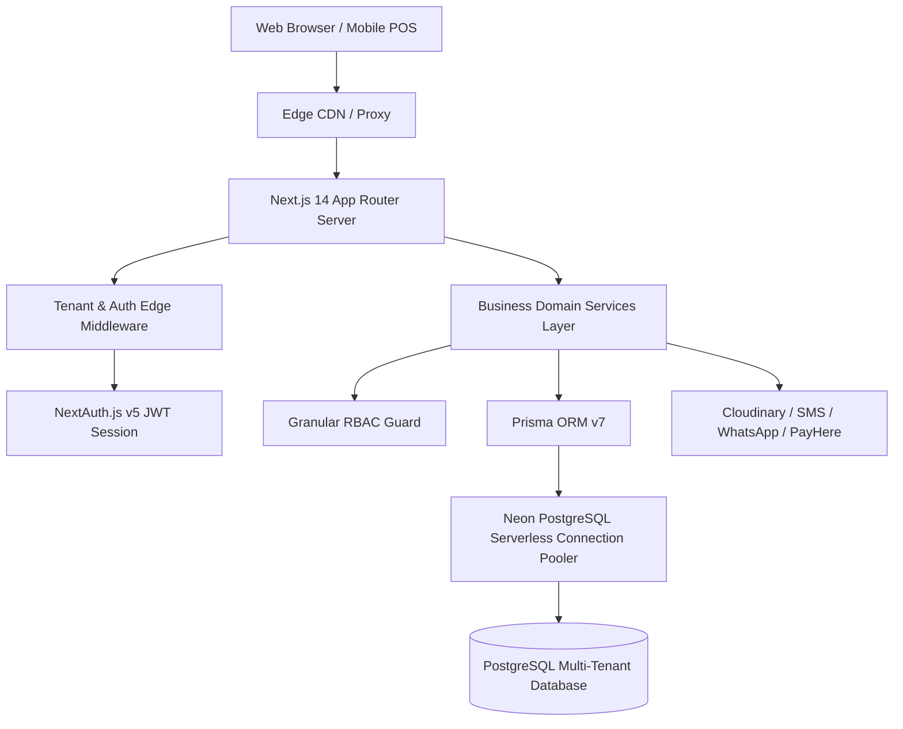

# Zentravo BMS — Technical Architecture

Zentravo BMS is a multi-tenant SaaS business management system engineered for high concurrency, strict tenant data isolation, and Sri Lankan retail compliance.

---

## 1. System Overview

---

## 2. Multi-Tenancy Architecture

### 2.1 Isolation Model
Zentravo BMS uses a **Shared Database, Shared Schema with Discriminator Column (`businessId`)** model:
- Every table storing business data includes an indexed `businessId String` field referencing `Business.id`.
- Tenant context is extracted server-side via `src/lib/tenant.ts` from the verified NextAuth JWT session.
- Database access helper functions enforce `where: { businessId: tenant.businessId }` on all queries.
- Multi-branch isolation allows users to be scoped to specific branch locations or view aggregated data across all company branches.

### 2.2 Security & Threat Mitigation
- Direct cross-tenant data leakage is prevented at both the middleware layer and the repository/service layer.
- Tenant ID cannot be injected or manipulated via client headers or query parameters; it is always derived from cryptographically signed JWT sessions.

---

## 3. Role-Based Access Control (RBAC)

The system features an enterprise-grade permissions framework:
- **78 Granular Permissions** across 16 core business modules (`pos.*`, `products.*`, `inventory.*`, `accounting.*`, `warranty.*`, `service.*`, etc.).
- **Dynamic Roles per Tenant**: While system roles (`OWNER`, `MANAGER`, `ACCOUNTANT`, `CASHIER`, `TECHNICIAN`, `STOCK_MANAGER`, `SALES_STAFF`, `DELIVERY_STAFF`) are provided with preconfigured sensible defaults, tenant owners can customize permissions for any role or define custom roles.
- Client-side checks use the `usePermissions()` hook (`can(PERMISSIONS.POS_CREATE_SALE)`).
- Server actions use `hasPermission(tenant.permissions, permission)` before executing sensitive operations.

---

## 4. Sri Lankan Localization & Tax Compliance

### 4.1 Currency
- Standard currency: **Sri Lankan Rupee (`LKR`)**, formatted as `Rs. 1,250.00`.
- Number formatting adheres to the `en-LK` locale standard.

### 4.2 Taxation (Inland Revenue Department Standards)
- **Value Added Tax (VAT)**: Configurable standard 18% rate with automatic tax invoice generation including VAT registration number and IRD required tax breakdowns.
- **Social Security Contribution Levy (SSCL)**: 2.5% support with tiered calculation options.
- **Tax Inclusive vs. Exclusive**: Product prices can be displayed and calculated tax-inclusive (retail shelf pricing) or tax-exclusive (B2B wholesale pricing).

---

## 5. Technology Stack Summary

| Layer | Component | Description |
|---|---|---|
| **Framework** | Next.js 14 App Router | React Server Components, Server Actions, Route Handlers |
| **Styling** | Tailwind CSS v4 | Dark mode, sleek glassmorphism, responsive grid |
| **Component System** | Radix UI + Lucide Icons | Accessible, keyboard-friendly primitives |
| **Database** | Neon PostgreSQL | Serverless PostgreSQL with pooling and automatic branch branching |
| **ORM** | Prisma v7 | Schema definitions, migration push, driver adapters (`@prisma/adapter-pg`, `@prisma/adapter-neon`) |
| **Auth** | NextAuth v5 (Auth.js) | JWT session strategy, password hashing (bcrypt), multi-tenant session payload |
| **State & Fetching** | TanStack React Query + Zustand | Client caching, POS state management |
| **Visualizations** | Recharts | Revenue trends, category share, cashier shift reporting |
| **Notifications** | Sonner | Rich toast notifications with action triggers |
